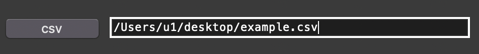
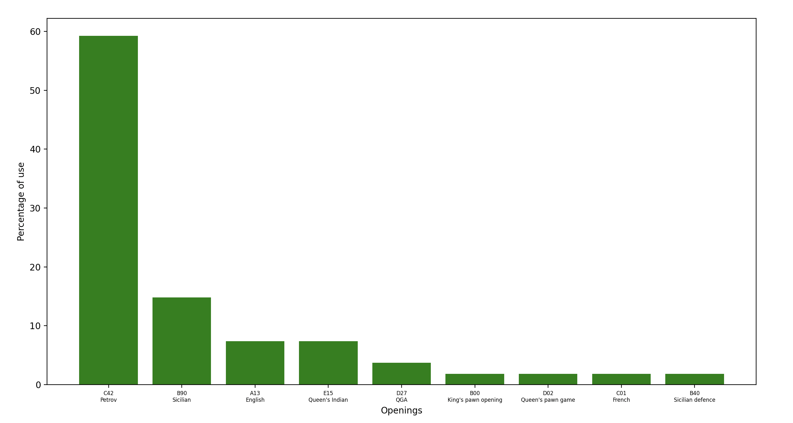

This research aims to explore and analyze in detail the operation of Koivisto, with the goal of understanding its peculiarities, its capabilities, and its impact in the context of modern chess engines.

Through this analysis, the aim is to contribute to the understanding of its architecture, its artificial intelligence techniques, and its performance.

## Repository structure:
- dataset
- results
- tools

## Dataset
- The dataset folder contains all PGN files
<figure>
  
  <figcaption>
    Example dataset from Banksia software
  </figcaption>
</figure>

## Tools
- The tools folder contains all the scripts implemented for the research. In the following, they will be illustrated one by one.

### games_manager is a script implemented for the management of PGN files (merge, split, CSV creation). this script makes use of a library created by me (pgn_manager). The library is available on PyPI and you can install it via pip. The script has a very simple graphical interface consisting of 4 menus.
- create_csv allows you to write matches from a PGN file to a CSV dataset. In addition, appropriate checks are performed to avoid writing a duplicate match thanks to the SHA-256 algorithm, which allowed me to create unique keys for each match.
- INPUT ONE: pgn path (example: C:\users\u1\documents\matches.pgn)
- INPUT TWO: csv path where matches will be saved (example: C:\users\u1\desktop\dataset.csv) If csv don't exists the script creates it
- As a second parameter, you can either input an existing CSV file directly:

or you can specify the path to a CSV file that does not exist. The script will then create the file and add the column names. For example, if you want to save the games in PGN format to a CSV file on the desktop that does not exist, you can simply specify the path to the desktop, the name of the desired PGN file, and the CSV extension:

---------------------------------------------------------------------------------------------------------------------------------------

-  merge_pgn allows you to merge PGN files.
- INPUT ONE: pgn file (example: C:\users\u1\documents\matches.pgn)
- INPUT TWO: path that contains pgn files (example: C:\users\u1\documents\folder_test)
- INPUT THREE: pgn_file where the first file games will be saved (example: C:\users\u1\documents\matches.pgn)
It is possible to specify a PGN file, a directory containing PGN files, or both. In the latter case, both the PGN file (first input) and the PGN files in the directory (second input) will be merged with the destination PGN (third input).

---------------------------------------------------------------------------------------------------------------------------------------

- split_pgn allows you to split multiple games from a PGN file. The output PGNs will be saved in a folder specified by the user.
- INPUT ONE: pgn file (example: C:\users\u1\documents\matches.pgn)
- INPUT TWO: folder where the games will be saved (example: C:\users\u1\documents\folder_matches)

---------------------------------------------------------------------------------------------------------------------------------------

### opening_analyzer
- it is a Python script that can analyze multiple games simultaneously to return information about openings (number of uses/wins, usage/win percentage)
- At the moment, the script does not have a graphical interface, but it is executed through the terminal. To analyze a pgn file on your computer, change the file path in the source code:

- Output example:

### ChessScoreAnalyzer
This tool has been designed with the goal of providing a detailed understanding of game dynamics, offering a visual representation of average scores associated with different phases of the game.

The code begins by utilizing the chess library to read chess games from a PGN file, providing a user-friendly interface for data analysis. During this process, the comment scores associated with each move executed during the game are extracted.

Subsequently, the code processes the extracted scores to calculate averages for each column (move). This is followed by the creation of a chart that clearly visualizes variations in average scores as a function of the number of moves.

The resulting chart provides an intuitive illustration of the distribution of average scores over the course of the analyzed chess games. Such representation is crucial for identifying patterns and trends in game dynamics.

### reg_log
It is a script for logistic regression and the construction of a predictive model on games played by the Koivisto chess engine. The program outputs a ROC curve, indicating the model's accuracy, along with a confusion matrix.
For logistic regression, the outcome of the game has been chosen as the dependent variable:
- 1 in case of victory
- 0 in case of defeat/draw

The independent variables selected are:
- PlayCount: the number of moves in a game
- Time for move: the time per move for each individual move
- Score: the average score of the first 10 moves by the white player

