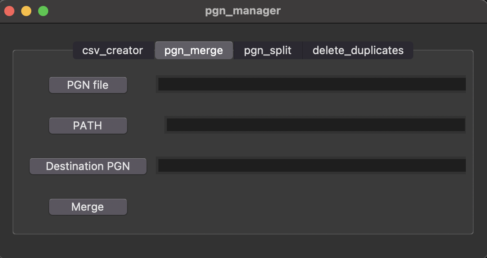

# tirocinio_lucacanali

## Linked repositories:
- https://github.com/AtreusArtic/tesi_739088
- https://github.com/Marsiius/tesi_marsichina_eros_745299
- https://github.com/marikascalise/ThesisAIchess

## Repository structure:
- dataset
- engine
- shared_materials
- tools

### Dataset
- The dataset folder contains all the available research data: PGN files, CSV files, graphs and everything related to data and analysis
<figure>
  
  <figcaption>
    Example dataset from Banksia software
  </figcaption>
</figure>

### Engine
- The research within this repository concerns the study, analysis, improvement, and comparison with other chess engines by Koivisto.
- Official site: https://koivisto-chess.com
- Resource code: https://github.com/Luecx/Koivisto

### Shared materials
- Folder containing the material shared with other research members

### Tools
- The tools folder contains all the scripts implemented for the research. In the following, they will be illustrated one by one.

### pgn_manager : is a script implemented for the management of PGN files (merge, split, CSV creation, duplicate removal). The script has a very simple graphical interface consisting of 4 menus.
- create_csv allows you to write matches from a PGN file to a CSV dataset. In addition, appropriate checks are performed to avoid writing a duplicate match thanks to the SHA-256 algorithm, which allowed me to create unique keys for each match.
- INPUT ONE: pgn path (example: C:\users\u1\documents\matches.pgn)
- INPUT TWO: csv path where matches will be saved (example: C:\users\u1\desktop\dataset.csv) If csv don't exists the script creates it
- As a second parameter, you can either input an existing CSV file directly:

or you can specify the path to a CSV file that does not exist. The script will then create the file and add the column names. For example, if you want to save the games in PGN format to a CSV file on the desktop that does not exist, you can simply specify the path to the desktop, the name of the desired PGN file, and the CSV extension:

- merge_pgn allows you to merge PGN files.
- INPUT ONE: pgn file (example: C:\users\u1\documents\matches.pgn)
- INPUT TWO: path that contains pgn files (example: C:\users\u1\documents\folder_test)
- INPUT THREE: pgn_file where the first file games will be saved (example: C:\users\u1\documents\matches.pgn)
It is possible to specify a PGN file, a directory containing PGN files, or both. In the latter case, both the PGN file (first input) and the PGN files in the directory (second input) will be merged with the destination PGN (third input).

---------------------------------------------------------------------------------------------------------------------------------------
- split_pgn allows you to split multiple games from a PGN file. The output PGNs will be saved in a folder specified by the user.
- INPUT ONE: pgn file (example: C:\users\u1\documents\matches.pgn)
- INPUT TWO: folder where the games will be saved (example: C:\users\u1\documents\folder_matches)

---------------------------------------------------------------------------------------------------------------------------------------
- delete_duplicate allows you to delete duplicate matches into PGN file that contain duplicate games.
- INPUT ONE: pgn_file
- INPUT TWO: destination path (where new PGN file will be saved)
---------------------------------------------------------------------------------------------------------------------------------------

### match_analyst
- PHASE TEST! Please use this code with caution
- match_analyst is a Python script that can analyze multiple games simultaneously to return information about openings (number of uses/wins, usage/win percentage)
- At the moment, the script does not have a graphical interface, but it is executed through the terminal. To analyze a pgn file on your computer, change the file path in the source code:

- Output example:

